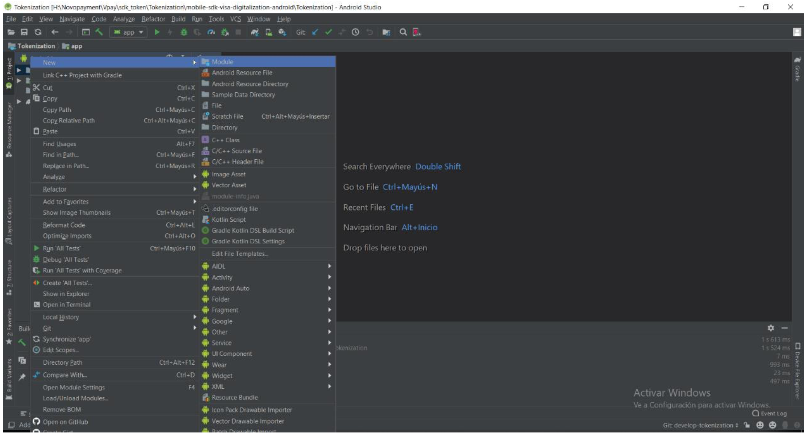
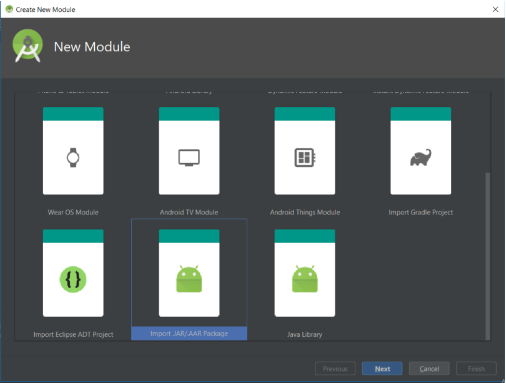
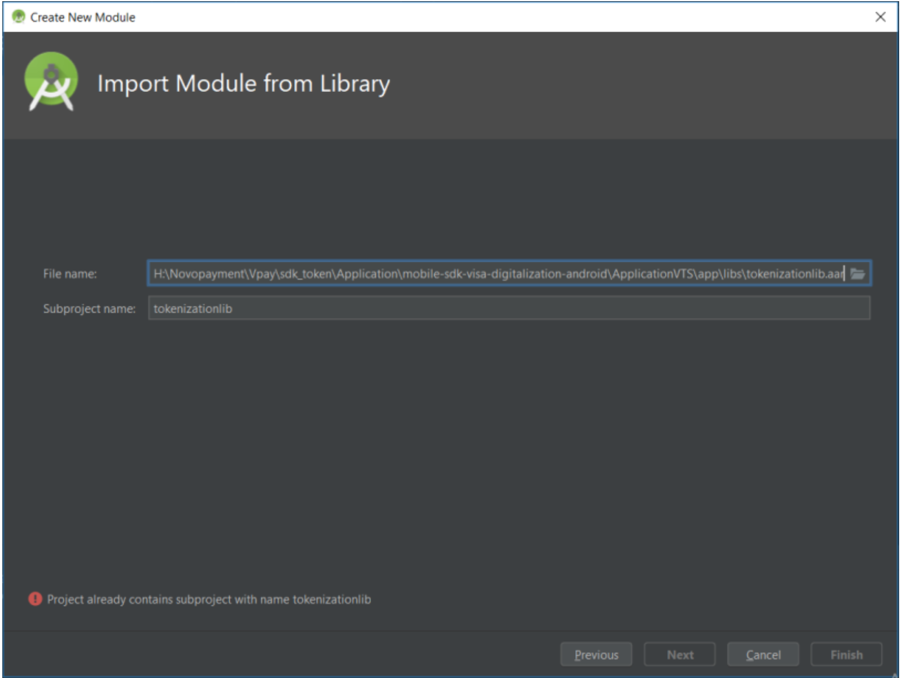
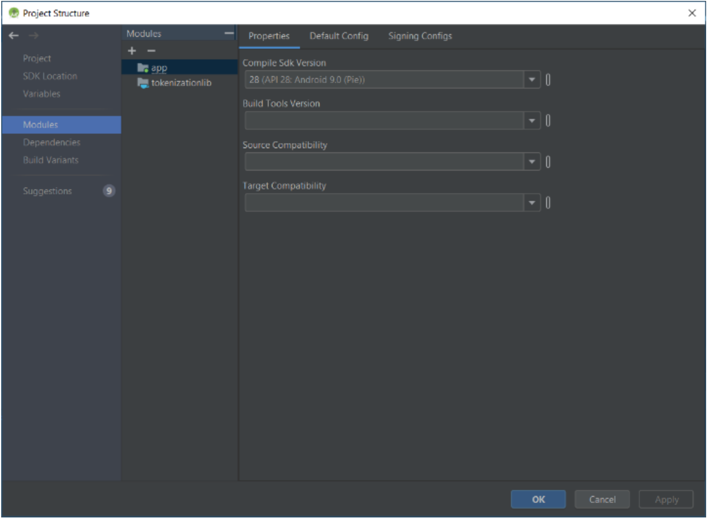
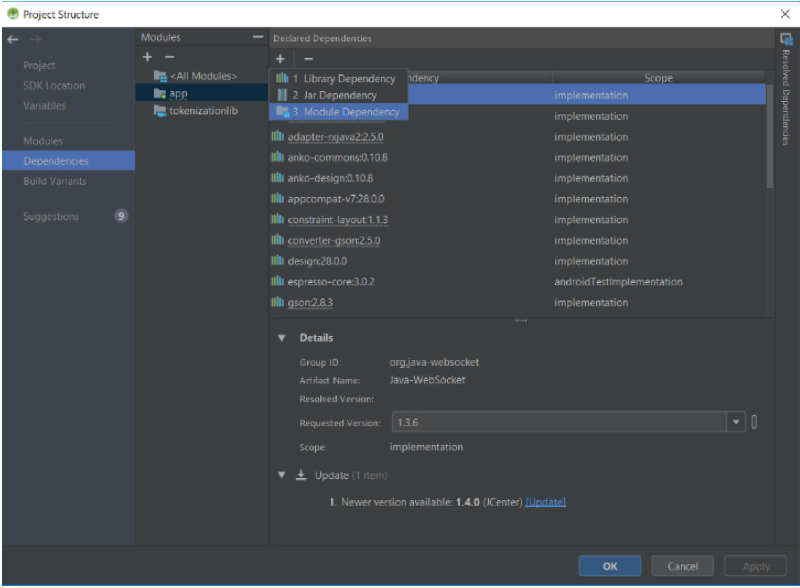
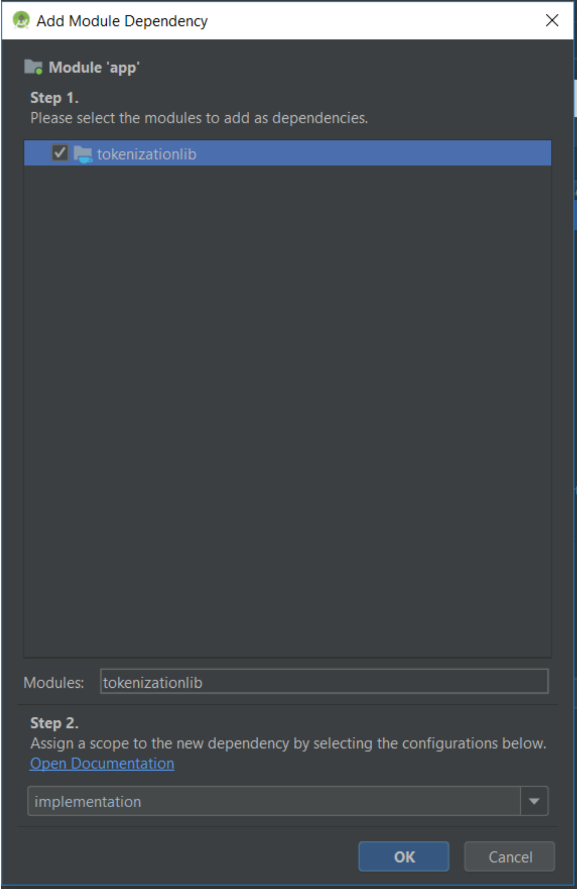

# 1. Instalación del SDK
A continuación, se describe los pasos para la correcta instalación de la librería:

## 1.1. Almacenamiento de la librería

Este proyecto le suministrara una librería denominada tokenizationlib.aar, almacénela en la carpeta libs de su aplicación principal.

## 1.2. Importación del modulo

Asegúrese de abrir la ventana Crear Nuevo Módulo, seleccione la opción Importar Paquete .JAR/.AAR, ubique el SDK cuando se le pida y asegúrese en llamar la librería con el siguiente nombre: tokenizationlib.






## 1.3. Importación de la dependencia del SDK

Oprima el botón F4 y asegúrese de abrir la ventana Estructura del proyecto, posiciónese sobre el módulo de su aplicación principal y abra la pestaña Dependencias, luego oprima sobre el botón + y escoja la opción 3 llamada Modulo Dependencia, deberá aparecer el modulo importado en el paso anterior, oprima en aceptar hasta que las ventanas se hallan cerrado, aguarde hasta que la sincronización de gradle haya finalizado.





## 1.4. Importación de las dependencias de terceros
Usted deberá importar las siguientes librerías en la sección dependencias en el gradle de su aplicación principal: 

```kt
dependencies { ....
implementation 'com.android.support:appcompat-v7:28.0.0'
implementation 'com.android.support.constraint:constraint-layout:1.1.3' implementation 'com.squareup.retrofit2:retrofit:2.5.0'
implementation 'com.squareup.retrofit2:converter-gson:2.5.0' implementation 'com.squareup.okhttp3:logging-interceptor:3.11.0' implementation 'com.squareup.retrofit2:adapter-rxjava2:2.5.0' implementation 'com.jakewharton.retrofit:retrofit2-rxjava2-adapter:1.0.0' implementation 'io.reactivex.rxjava2:rxandroid:2.1.0'
implementation 'io.reactivex.rxjava2:rxjava:2.2.6'
implementation 'com.google.code.gson:gson:2.8.5'
implementation 'org.java-websocket:Java-WebSocket:1.3.6'
implementation 'org.jetbrains.kotlinx:kotlinx-coroutines-core:1.2.0'
implementation "org.jetbrains.kotlinx:kotlinx-coroutines-android:1.2.0" }
```

